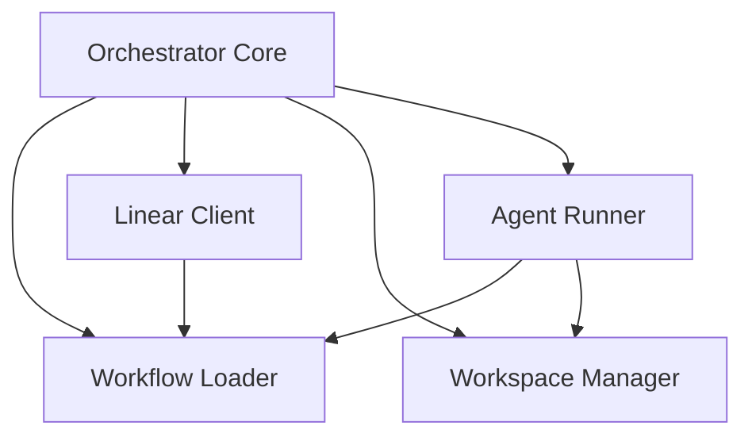

# Unit of Work Dependency Matrix

This document defines the dependencies between the logical units of work.

| Unit | Depends On | Dependency Type |
| --- | --- | --- |
| **Unit 5: Orchestrator Core** | Unit 1: Workflow Loader | Configuration & Prompt Template |
| **Unit 5: Orchestrator Core** | Unit 2: Linear Tracker Client | Issue Data & State Reconciliation |
| **Unit 5: Orchestrator Core** | Unit 3: Workspace Manager | Workspace Paths & Cleanup Hooks |
| **Unit 5: Orchestrator Core** | Unit 4: Agent Runner | Spawning Sessions & Handshake |
| **Unit 4: Agent Runner** | Unit 1: Workflow Loader | Codex Launch Commands |
| **Unit 4: Agent Runner** | Unit 3: Workspace Manager | Working Directory Paths |
| **Unit 2: Linear Tracker Client** | Unit 1: Workflow Loader | Linear Auth & Project Slug |

## Dependency Visualization

