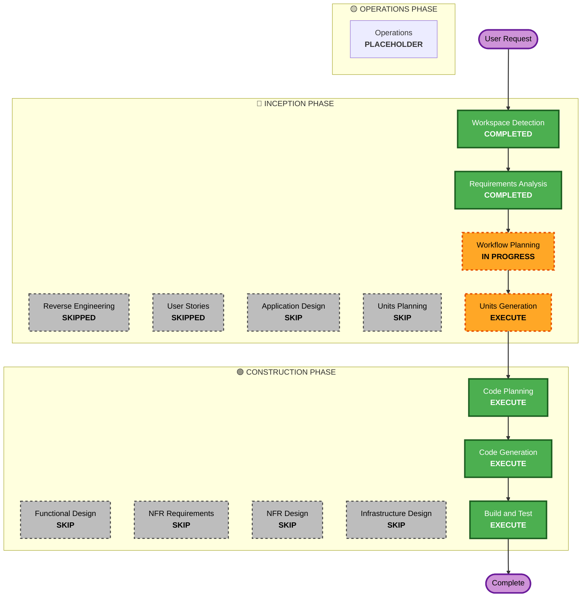

# Execution Plan

## Detailed Analysis Summary

### Change Impact Assessment
- **User-facing changes**: No - This is a backend orchestrator daemon/CLI, there is no UI.
- **Structural changes**: Yes - Building a completely new orchestrator engine and subprocess runner.
- **Data model changes**: Yes - Implementing in-memory states (running, claimed, retry queues) and domain entities (Issues, Workspaces).
- **API changes**: Yes - Implementing the `linear` tracker integration and JSON-line protocol for the agent subprocess.
- **NFR impact**: Yes - Strict enforcement of BDD/TDD, statelessness on restart, and structural JSON logging.

### Risk Assessment
- **Risk Level**: Medium (Time-constrained, complex async/polling orchestration logic).
- **Rollback Complexity**: Easy (Greenfield, no existing production state).
- **Testing Complexity**: Moderate (Requires mocks for Linear API and stdio subprocesses to adhere to BDD/TDD requirements).

## Workflow Visualization

## Phases to Execute

### 🔵 INCEPTION PHASE
- [x] Workspace Detection (COMPLETED)
- [x] Reverse Engineering (SKIPPED - Greenfield)
- [x] Requirements Elaboration (COMPLETED)
- [x] User Stories (SKIPPED - Backend orchestration daemon, no explicit UI personas)
- [x] Execution Plan (IN PROGRESS)
- [ ] Application Design - SKIP
  - **Rationale**: Strict TDD/BDD means we design through tests; detailed application design phase would slow us down given the 1-hour timebox.
- [ ] Units Planning - SKIP
  - **Rationale**: Bypassed in favor of direct Units Generation.
- [ ] Units Generation - EXECUTE
  - **Rationale**: The user explicitly requested we generate the "AIDLC working units" formatted for Linear. We need to create these to define the BDD steps.

### 🟢 CONSTRUCTION PHASE
- [ ] Functional Design - SKIP
  - **Rationale**: Covered by the BDD test specifications we will write.
- [ ] NFR Requirements - SKIP
  - **Rationale**: NFRs are already defined in the main requirements document.
- [ ] NFR Design - SKIP
  - **Rationale**: Simple stateless daemon architecture.
- [ ] Infrastructure Design - SKIP
  - **Rationale**: No cloud infrastructure needed, just a local CLI tool.
- [ ] Code Planning - EXECUTE (ALWAYS)
  - **Rationale**: Needed to map units to BDD feature files and TDD test suites.
- [ ] Code Generation - EXECUTE (ALWAYS)
  - **Rationale**: Actual implementation of the orchestrator.
- [ ] Build and Test - EXECUTE (ALWAYS)
  - **Rationale**: Verify the Core Conformance test suite passes.

### 🟡 OPERATIONS PHASE
- [ ] Operations - PLACEHOLDER
  - **Rationale**: Future deployment and monitoring workflows

## Estimated Timeline
- **Total Phases**: 5 remaining (Units Generation, Code Planning, Code Gen, Build/Test).
- **Estimated Duration**: ~1 Hour (Timebox target).

## Success Criteria
- **Primary Goal**: Complete an executable Node.js CLI that implements the Core Conformance of the Symphony Spec.
- **Key Deliverables**: 
  - Working Units exported for Linear.
  - BDD Feature files (`.feature`).
  - TDD Unit/Integration tests.
  - Executable TypeScript codebase.
- **Quality Gates**: All BDD/TDD tests must pass locally.